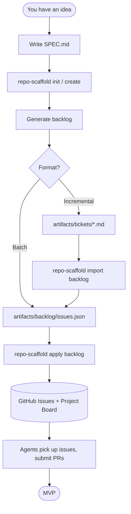

# examples/

Reference artifacts for repo-scaffold. Read this if you are an agent or a new contributor
trying to understand how to use this tool.

---

## Workflow



---

## Artifacts in this directory

| File | What it is |
|------|-----------|
| [spec.sample.md](spec.sample.md) | Fully filled-out SPEC.md for a realistic project (TaskFlow). Copy and adapt for your own project. |
| [backlog/issues.sample.json](backlog/issues.sample.json) | A minimal issues.json showing the epic + ticket structure expected by `apply backlog`. |
| [tickets/epic.sample.md](tickets/epic.sample.md) | A filled-out epic using the `.github/ISSUE_TEMPLATE/epic.md` format. |
| [tickets/ticket.sample.md](tickets/ticket.sample.md) | A filled-out ticket using the `.github/ISSUE_TEMPLATE/ticket.md` format. |

---

## Where does the backlog live?

`artifacts/` at the repo root (gitignored -- ephemeral, upload-once).

```
your-repo/
  artifacts/
    backlog/
      issues.json          # compiled backlog -- apply this to GitHub
    tickets/
      my-feature.md        # individual ticket drafts -- import these first
```

Compile tickets from `artifacts/tickets/*.md` into JSON:

```bash
poetry run repo-scaffold import backlog --repo OWNER/REPO
# writes to local/backlog/OWNER/REPO/issues.json
```

Apply with:

```bash
poetry run repo-scaffold apply backlog --repo OWNER/REPO --path .
```

---

## How to create issues

**Option A -- Batch JSON (greenfield, all at once):**

Write or generate `artifacts/backlog/issues.json` following the structure in
[backlog/issues.sample.json](backlog/issues.sample.json), then:

```bash
poetry run repo-scaffold apply backlog --repo OWNER/REPO
```

**Option B -- Individual markdown files (incremental):**

Drop one or more `.md` files into `artifacts/tickets/`. Use the templates in
[tickets/epic.sample.md](tickets/epic.sample.md) and [tickets/ticket.sample.md](tickets/ticket.sample.md).
Then compile and push:

```bash
poetry run repo-scaffold import backlog --repo OWNER/REPO
# writes to local/backlog/OWNER/REPO/issues.json
poetry run repo-scaffold apply backlog --repo OWNER/REPO --path .
```

Both paths create GitHub issues. To also add them to the project board, pass
`--with-project` (or `--project-title`) to `apply backlog`.

---

## How to contribute to repo-scaffold

1. Check [AGENTS.md](../AGENTS.md) for the full command reference and auth setup.
2. Pick an open issue from the [repo-scaffold Roadmap](https://github.com/users/blairg23/projects/6).
3. Branch off `main`: `git checkout -b feat/your-feature`.
4. Run the gate before committing: `python -m pre_commit run --all-files`.
5. Open a draft PR referencing the issue -- use the PR template.

---

## Quick reference

```bash
# Auth: set GH_TOKEN in .env (see .env.example)

# Issues
poetry run repo-scaffold issue create --repo OWNER/REPO --title "Title" --body "Body"
poetry run repo-scaffold issue list --repo OWNER/REPO

# PRs
poetry run repo-scaffold pr create --repo OWNER/REPO --title "Title" --head feat/branch
poetry run repo-scaffold pr list --repo OWNER/REPO

# Backlog
poetry run repo-scaffold import backlog --repo OWNER/REPO
poetry run repo-scaffold apply backlog --repo OWNER/REPO

# Scaffold
poetry run repo-scaffold init --name NAME --languages react,python --owner OWNER --out ./NAME
poetry run repo-scaffold create --repo OWNER/NAME --visibility public --path .
```
