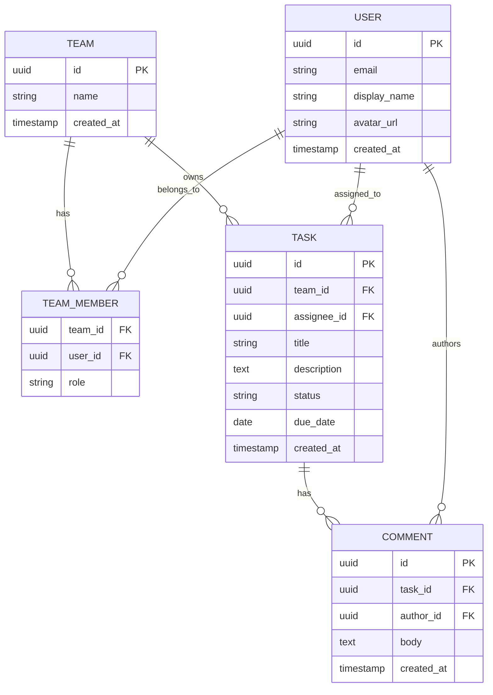
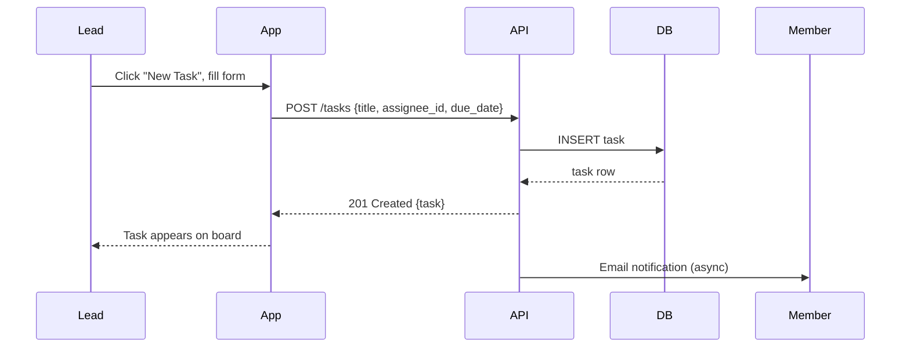
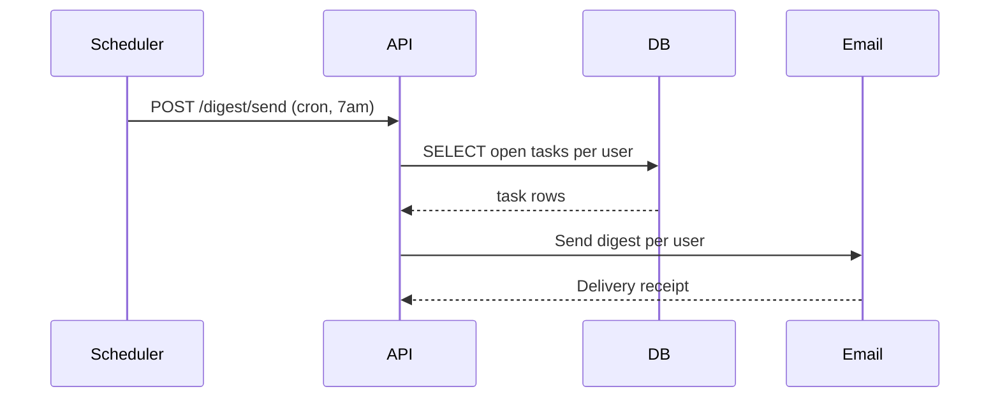

# TaskFlow -- SPEC

> This is a filled-out example. Copy it, rename it SPEC.md, and replace the content with your own project.

---

## Goal

TaskFlow is a lightweight task management web app for small teams. It lets users create tasks,
assign them to teammates, track status across a shared board, and get daily digest emails.
It exists because Jira is too heavy and plain GitHub issues lack status lanes and email digests.

---

## Users

**Team member** -- Creates and updates tasks, drags them across status lanes, comments on tasks.

**Team lead** -- Assigns tasks to members, sets deadlines, views the full board for any member.

**Observer** -- Read-only access to the board; receives the daily digest but cannot edit tasks.

---

## Screens

| Screen | Description |
|--------|-------------|
| Login | Supabase Auth email/password or magic link |
| Board | Kanban board: Todo, In Progress, Done lanes |
| Task detail | Title, description, assignee, due date, comments |
| Team settings | Invite members, set roles, configure digest schedule |
| Profile | Display name, avatar, notification preferences |

---

## Architecture

### Frontend

- Framework: React + Vite
- Styling: Tailwind CSS
- Auth: Supabase Auth (JWT)
- Deploy: Netlify (preview on PR, production on merge to main)

### Backend

- Language: Python
- API style: REST
- Auth: Supabase Auth (JWT validation)
- Deploy: Coolify (Docker, self-hosted)

### Data

- DB: Supabase (Postgres)
- Storage: Supabase Storage (task attachments)
- Migrations: Supabase CLI

### Infrastructure

- CI: GitHub Actions (lint, type check, build, test)
- Secrets: GitHub repository secrets
- Environments: preview (PR) + production (main branch)

---

## Data Model

---

## Flows

### Create and assign a task

### Daily digest

---

## Non-functional Requirements

- Performance: Board load under 500ms for up to 200 tasks
- Security: All API routes require valid Supabase JWT; no PII in logs
- Accessibility: WCAG 2.1 AA
- Platforms: Web (desktop + mobile browser); no native app in MVP

---

## Design

<!-- v0.dev link: https://v0.dev/t/abc123 -->

---

## Out of Scope (MVP)

- Native mobile app
- Recurring tasks
- Time tracking
- Third-party integrations (Slack, GitHub)
- File attachments (post-MVP Supabase Storage addition)
- Billing or seat limits
